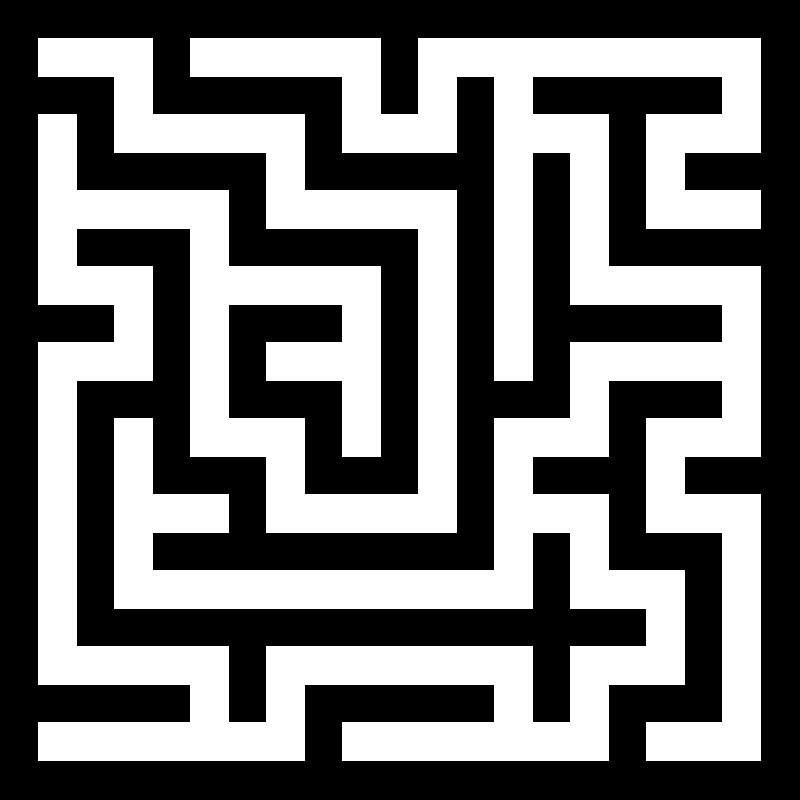

# MazeGenerator
This is a sample project for me to learn and test the maze generation algorithm. The project uses C++and EasyX libraries for visual verification. Currently, two algorithms are available: the first is randomized DFS, and the second is Prim algorithm. The screenshots are as follows:

blank is wall,  white is path

**1 dfs**

**2 prim**

